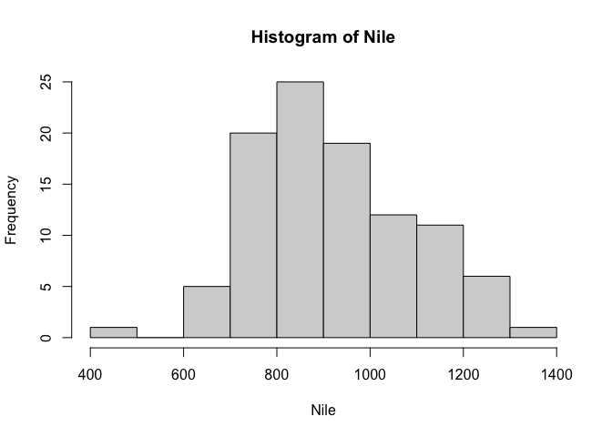

## First Steps

To store a vector to a variable, we do the following:

    x <- c(1,2,4)

We can also store this variable into a new variable:

    q <- c(x,x,8)

Then, we print `q`:

    q

    ## [1] 1 2 4 1 2 4 8

To pull out the individual element, we do the following:

    x[3]

    ## [1] 4

Elements of vectors in R are indexed at 1, **not** 0. For example, we
would get an error if we tried to find `x[0]`. Importantly, we can also
do subsets (or slicing, if we’re talking about Python syntax).

    x[2:3]

    ## [1] 2 4

The syntax `x[2:3]` means we start at index 2 (or the 2nd element) and
go until (and including) index 3 (or the 3rd element). For example, with
our vector `q`:

    q[2:4]

    ## [1] 2 4 1

We can also find some values:

    mean(x)

    ## [1] 2.333333

    sd(x)

    ## [1] 1.527525

R also has a bunch of internal data sets that we can use for our own
edification by typing in the following:

    data()

For example, we can use the dataset `Nile` for some fun:

    mean(Nile)

    ## [1] 919.35

    sd(Nile)

    ## [1] 169.2275

    hist(Nile)

